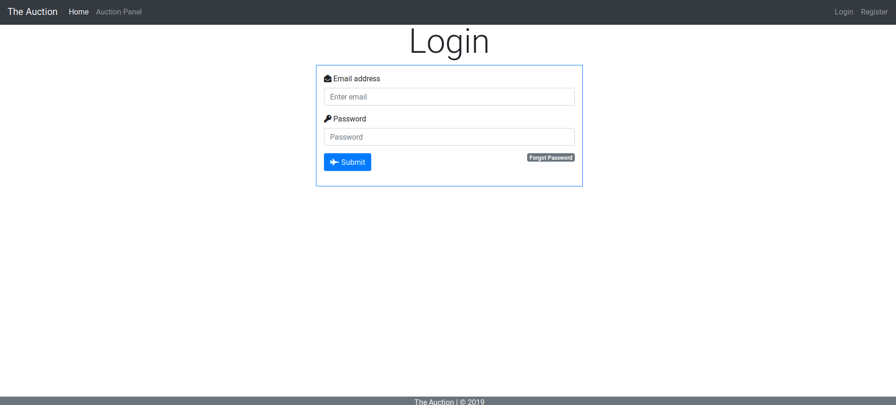
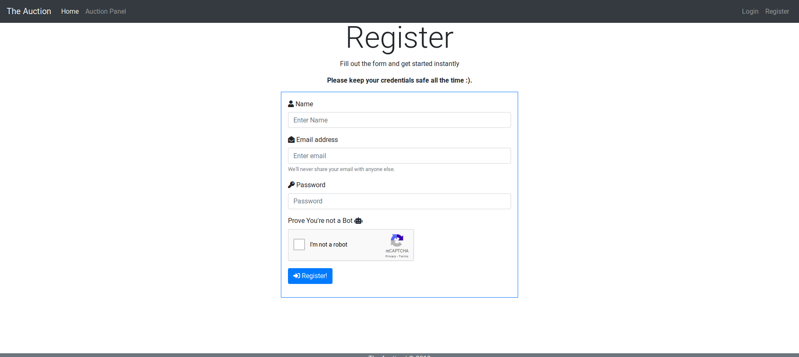

# Auction/Bidding Website

This website is developed as a part for ongoing Web Development competition at Advaita 2k19.

# Usage

Make sure to have Python 2 installed.

Install all dependencies using: `pip install -r requirements.txt`

To start the server: `python app.py`

# Note
For creating Database use `python2 database.py`

# Login

# Register

